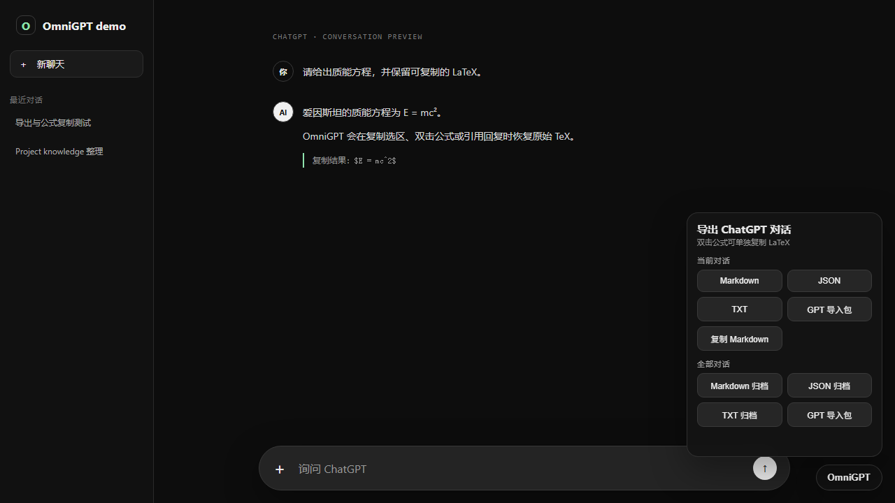
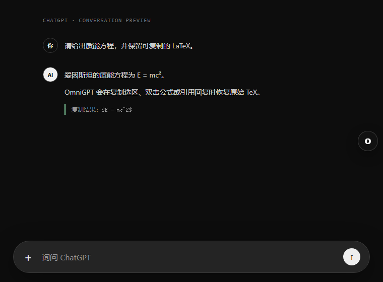

# OmniGPT

<div align="center">

<strong>让 ChatGPT 对话真正可带走，让数学公式真正可复制。</strong>

<br>

导出当前或全部聊天记录，并在复制、双击和引用时保留原始 LaTeX。

<br><br>

<a href="https://greasyfork.org/zh-CN/scripts/590463-omnigpt-chatgpt-export-latex-copy"></a>
<a href="https://raw.githubusercontent.com/sakur7a/OmniGPT/main/OmniGPT.user.js"></a>

<br><br>

<a href="https://github.com/sakur7a/OmniGPT/blob/main/package.json"></a>
<a href="https://greasyfork.org/zh-CN/scripts/590463-omnigpt-chatgpt-export-latex-copy"></a>
<a href="LICENSE"></a>


</div>

---

## Demo

### 一个面板，四种去向

当前对话可以直接下载或复制；全部历史对话可以整理成单个归档，或拆分成适合重新上传给 GPT / Project knowledge 的参考文件。



### 分屏时自动让开输入框

宽屏显示完整按钮；左右分屏或窄窗口自动收拢成右侧的圆形入口，不遮挡 ChatGPT 的输入、语音和发送按钮。



### 公式复制不再丢失 TeX

```text
页面显示       E = mc²
原生复制       [公式缺失或渲染碎片]
OmniGPT 复制   $E = mc^2$
```

框选整段、双击单个公式，或使用 ChatGPT 的选区引用，都能恢复行内 `$...$` 与块级 `$$...$$` 公式。

## 能做什么

| 场景 | OmniGPT 的处理 |
| --- | --- |
| 导出当前对话 | 从当前页面读取内容，保留标题、角色、代码块、列表、表格、链接和 LaTeX |
| 导出全部历史 | 使用当前 ChatGPT 登录会话分页读取历史记录，并汇总失败项 |
| Markdown | 适合归档、Obsidian、知识库和版本管理 |
| JSON | 保留结构化字段，方便程序处理 |
| TXT | 纯文本阅读和全文搜索 |
| GPT 导入包 | 将长历史拆成适合上传给 ChatGPT、Project 或 GPT knowledge 的 Markdown |
| 复制 Markdown | 不产生下载，直接将当前对话写入剪贴板 |
| LaTeX 复制 | 选区复制、双击公式和选区引用均返回原始 TeX |

> [!NOTE]
> “GPT 导入包”是参考材料，不是 ChatGPT 原生聊天记录恢复文件。

## 安装

### 推荐：Greasy Fork

1. 安装 [Tampermonkey](https://www.tampermonkey.net/) 或兼容的 userscript 管理器。
2. 打开 [OmniGPT · Greasy Fork](https://greasyfork.org/zh-CN/scripts/590463-omnigpt-chatgpt-export-latex-copy)。
3. 点击“安装此脚本”，确认安装后刷新 [chatgpt.com](https://chatgpt.com/)。

Greasy Fork 版本会通过 userscript 管理器自动检查更新。

### 备用：GitHub Raw

如果 Greasy Fork 暂时不可访问，可使用 [GitHub Raw 安装地址](https://raw.githubusercontent.com/sakur7a/OmniGPT/main/OmniGPT.user.js)。

## 使用

### 导出聊天

1. 打开任意 ChatGPT 对话。
2. 点击页面右下角的 **OmniGPT**；窄屏时点击右侧圆形 **O**。
3. 选择当前对话或全部对话，以及目标格式。
4. 等待浏览器下载；大量历史记录可能需要一些时间。

### 复制公式

- **框选复制**：像平常一样框选含公式的内容并按 `Ctrl+C`。
- **双击公式**：直接将单个公式复制为 LaTeX。
- **选区引用**：ChatGPT 读取选区时会获得 TeX，而不是渲染层的碎片文本。

## 隐私与权限

- 没有分析、广告、遥测或第三方上传。
- 当前对话的解析和文件生成都在浏览器本地完成。
- “全部对话”只向当前 ChatGPT 站点请求数据，并复用已有登录状态。
- 脚本仅匹配 `chatgpt.com` 与旧版 `chat.openai.com`。

> [!WARNING]
> ChatGPT 的页面结构和历史接口并非稳定公共 API。站点更新后，如果“全部对话”失效，请提交 issue，并附上浏览器版本、复现步骤和已移除隐私信息的 `[OmniGPT]` 控制台错误。

## 本地开发

需要 Node.js 20 或更高版本；没有第三方运行时依赖。

```bash
git clone https://github.com/sakur7a/OmniGPT.git
cd OmniGPT
npm run check
```

```text
OmniGPT/
├─ OmniGPT.user.js       # 可直接安装的构建产物
├─ src/
│  ├─ exporter.js        # 对话采集、格式化与下载
│  └─ omnigpt.js         # 页面入口、UI 与 LaTeX 复制
├─ scripts/build.mjs     # userscript 构建脚本
├─ test/                 # Node.js 回归测试
└─ docs/                 # README demo 与演示资产
```

修改 `src/` 后运行：

```bash
npm run build   # 重新生成 OmniGPT.user.js
npm run check   # 构建、语法检查和回归测试
```

## 兼容性

主要面向最新版 Chrome、Edge 与 Tampermonkey。Firefox / Violentmonkey 采用相同 userscript 标准，但尚未覆盖完整的手工回归矩阵。

## 参与和反馈

- Bug 与兼容性问题：[GitHub Issues](https://github.com/sakur7a/OmniGPT/issues)
- 源码与版本记录：[GitHub Repository](https://github.com/sakur7a/OmniGPT)
- 在线安装与反馈：[Greasy Fork](https://greasyfork.org/zh-CN/scripts/590463-omnigpt-chatgpt-export-latex-copy)

## 来源与许可

导出逻辑基于此前的 `chatgpt-exporter` 项目整理。LaTeX 兼容思路来自 ChatGPT Better TeX Quote（schweigen，MIT）与 TexCopyer（yjy / blime，GPL-3.0）；完整说明见 [THIRD_PARTY_NOTICES.md](THIRD_PARTY_NOTICES.md)。

OmniGPT 以 [GPL-3.0-or-later](LICENSE) 发布。
