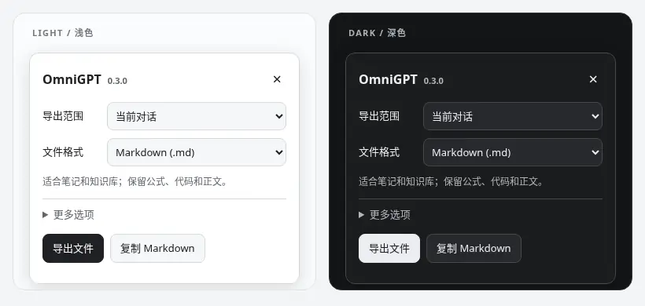

<div align="center">

<h1>OmniGPT</h1>

<p><strong>让对话可归档，让公式可编辑。</strong></p>
<p>轻量的 ChatGPT 对话导出与 LaTeX 复制脚本。</p>

<p>
  <a href="https://raw.githubusercontent.com/sakur7a/OmniGPT/main/OmniGPT.user.js"><strong>安装脚本</strong></a>
  &nbsp; · &nbsp;
  <a href="https://greasyfork.org/zh-CN/scripts/590463-omnigpt-chatgpt-export-latex-copy">Greasy Fork</a>
  &nbsp; · &nbsp;
  <a href="#开始使用">使用指南</a>
  &nbsp; · &nbsp;
  <a href="https://github.com/sakur7a/OmniGPT/releases">版本记录</a>
</p>

<p>
  <a href="https://github.com/sakur7a/OmniGPT/releases/latest"></a>
  <a href="https://github.com/sakur7a/OmniGPT/actions/workflows/build-userscript.yml"></a>
</p>

</div>

<p align="center">
  
</p>
<p align="center"><sub>0.3.0 面板实录 · 本地演示环境 · 更多选项按需展开</sub></p>

**对话归档** — 将当前对话或历史列表导出为 Markdown、JSON、TXT，也可拆成参考材料分片。<br>
**公式保真** — 复制 TeX 源码，区分行内与独立公式，不夹带 KaTeX / MathML 的渲染副本。<br>
**按需运行** — 默认不持续扫描页面；复制时处理选区，导出时才请求数据，首次打开才创建面板。

## 开始使用

1. 在浏览器安装 [Tampermonkey](https://www.tampermonkey.net/) 或兼容的用户脚本管理器。
2. 打开 **[GitHub 安装地址](https://raw.githubusercontent.com/sakur7a/OmniGPT/main/OmniGPT.user.js)**，确认安装。也可从 [Greasy Fork](https://greasyfork.org/zh-CN/scripts/590463-omnigpt-chatgpt-export-latex-copy) 安装，以该站实际发布的版本为准。
3. 刷新 ChatGPT。点击右下角 **OmniGPT** 打开面板；窄屏时入口收拢为右侧 **O**。

> 更新脚本后，也需要刷新已打开的 ChatGPT 标签页，再重新复制内容。请只保留一份启用的 OmniGPT。

## 复制：保留公式源码

选中含公式的回复并复制，得到可继续编辑的**纯文本 Markdown**，而不是公式图片或网页渲染碎片。

| 操作 | 结果 |
| :--- | :--- |
| 框选后 `Ctrl+C` / `⌘C` | 复制选中内容，保留其中的公式、代码和基础 Markdown 结构 |
| 双击公式 | 复制完整公式，自动保留行内或独立显示形式 |
| `Alt` / `Option` ＋双击公式 | 只复制 TeX 源码，不加定界符，适合粘进已有公式环境 |

例如，一段包含两种公式的回复会复制为：

```markdown
设序列为 $x_1, \ldots, x_n$，其均值为：

$$
\bar{x} = \frac{1}{n} \sum_{k=1}^{n} x_k
$$
```

在 **更多选项 → 公式复制** 中，可以切换为 LaTeX 定界符 `\(…\)` / `\[…\]`。普通文本选区和输入框里的复制保持原生行为；只有需要增强原生选区引用时，才开启默认关闭的**引用兼容**。

<details>
<summary>公式复制的几个边界</summary>

- 选中公式的一部分，也会恢复该公式的完整 TeX；不扩展选区外的普通正文。
- `G_k` 与 `G\_k` 保持原义，不擅自互换。没有可靠源码时，不把公式朗读标签当成 TeX。
- 此设置控制渲染公式的复制。API 导出保留原文已有定界符，不对整篇正文做正则替换。
- ChatGPT 回复底部的原生复制按钮可能绕过浏览器 `copy` 事件。需要确定的输出格式时，使用框选复制、双击，或 OmniGPT 面板中的**复制 Markdown**。

详见 [公式规则与当前版本说明](docs/V0.3.0.md)。

</details>

## 导出：选择范围和格式

打开面板，选择**导出范围**和**文件格式**，点击**导出文件**。只想把当前对话带到笔记或另一段聊天中，点击**复制 Markdown**即可。

| 格式 | 适合用途 |
| :--- | :--- |
| **Markdown** `.md` | 笔记、知识库、版本管理；保留正文中的公式和代码 |
| **JSON** `.json` | 程序处理；保留结构化正文、来源及警告信息 |
| **TXT** `.txt` | 纯文本阅读与搜索；API 正文原有的 Markdown 标记仍可能保留 |
| **参考材料分片** `.md` | 将长对话整理为可上传的参考材料，按消息边界拆分 |

当前对话默认优先通过 API 读取当前分支，失败时回退到已加载页面；也可在**更多选项**中选择离线页面采集。历史导出可选列表返回的全部，或限制为最近 **50 / 200** 条。

读取期间显示进度与成功、失败数量，支持取消；关闭面板也会取消正在读取的任务。多个分片逐个点击保存，不自动弹出一批下载请求。

> **导出不等于完整账号备份。** 页面采集可能缺失屏幕外消息；历史范围以当前账号列表返回结果为准；图片、附件仅保留可用引用或占位，不打包原文件。读取失败和完整性警告会保留在导出结果中。

## 轻量运行，数据留在本地

没有广告、遥测或第三方上传。复制不请求后端，也不读取剪贴板；导出仅向当前 ChatGPT 站点请求数据，文件在浏览器本地生成。

默认不安装持续页面观察器、不轮询、不缓存整页公式，也不全局接管网络、剪贴板或浏览器选区方法。面板使用原生 DOM 和 CSS，没有 UI 框架、外部字体或第三方运行时依赖。

大批量导出仍需要内存与处理时间，并非零开销。首次导出较多历史时，建议先用最近 50 条确认结果。

## 常见问题

<details>
<summary><strong>GitHub 已有新版，为什么油猴仍提示没有更新？</strong></summary>

检查已安装脚本的版本和更新来源。GitHub Raw 安装版从仓库获取更新；Greasy Fork 安装版需要该站先发布对应版本。**GitHub Release 成功不代表 Greasy Fork 已同步。**

可通过上方 GitHub 安装地址更新，确认版本后刷新 ChatGPT。维护者的一次性同步设置见 [发布说明](docs/RELEASING.md)。

</details>

<details>
<summary><strong>粘贴到 Obsidian、微信或其他编辑器，格式还会变化吗？</strong></summary>

OmniGPT 处理的含公式选区只写入 `text/plain`，避免公式的 HTML 与 MathML 副本混入。目标编辑器或其插件仍可能继续转换这些纯文本，脚本不能保证所有粘贴端表现完全一致。

排查时先更新脚本、刷新源页面并重新复制，再确认使用的是框选复制，而非站点原生回复复制按钮。旧剪贴板内容不会随插件升级自动修复。

</details>

<details>
<summary><strong>导出的 JSON 或参考材料分片能恢复原生聊天记录吗？</strong></summary>

不能。JSON 是整理后的对话数据，参考材料分片是可供模型阅读的 Markdown，均不是 ChatGPT 原生聊天恢复文件。DOM 回退、列表覆盖范围和附件保留方式也会影响完整性。

</details>

<details>
<summary><strong>支持哪些浏览器？遇到问题如何反馈？</strong></summary>

主要面向 Chrome、Edge 与 Tampermonkey，脚本匹配 `chatgpt.com` 和旧版 `chat.openai.com`，不在子框架注入。自动回归使用 Chromium、代表性页面和模拟 API；不等同于桌面应用、ChatGPT 登录态或 Firefox / Violentmonkey 的完整端到端覆盖。

请在 [GitHub Issues](https://github.com/sakur7a/OmniGPT/issues) 提供脚本版本、浏览器版本、具体操作与脱敏后的错误信息。**不要提交 access token、会话 cookie 或私密对话。**

</details>

## 开发与文档

[当前功能与设计取舍](docs/V0.3.0.md) · [复制机制与性能说明](docs/CLIPBOARD.md) · [发布与同步](docs/RELEASING.md)

<details>
<summary>本地构建与测试</summary>

建议使用与 CI 一致的 Node.js 24。修改 `src/`，不要直接编辑生成的 `OmniGPT.user.js`。

```bash
git clone https://github.com/sakur7a/OmniGPT.git
cd OmniGPT
npm run check       # 构建、元数据校验、语法检查和 Node 回归
```

浏览器测试仅用于开发，不打包进安装脚本。创建并激活 Python 虚拟环境后运行：

```bash
python -m pip install playwright==1.57.0
python -m playwright install chromium
python test/browser-regression.py
python test/browser-v030.py
```

核心源码：`src/clipboard.js` 处理复制，`src/exporter.js` 处理采集与导出，`src/omnigpt.js` 负责面板。CI 会在发布前执行 Node 和浏览器回归测试。

</details>

---

### 来源与许可

导出逻辑基于此前的 `chatgpt-exporter` 项目整理。LaTeX 兼容思路来自 ChatGPT Better TeX Quote（schweigen，MIT）与 TexCopyer（yjy / blime，GPL-3.0）。完整说明见 [第三方声明](THIRD_PARTY_NOTICES.md)。

[GPL-3.0-or-later](LICENSE) · [问题反馈](https://github.com/sakur7a/OmniGPT/issues) · [版本记录](https://github.com/sakur7a/OmniGPT/releases)
